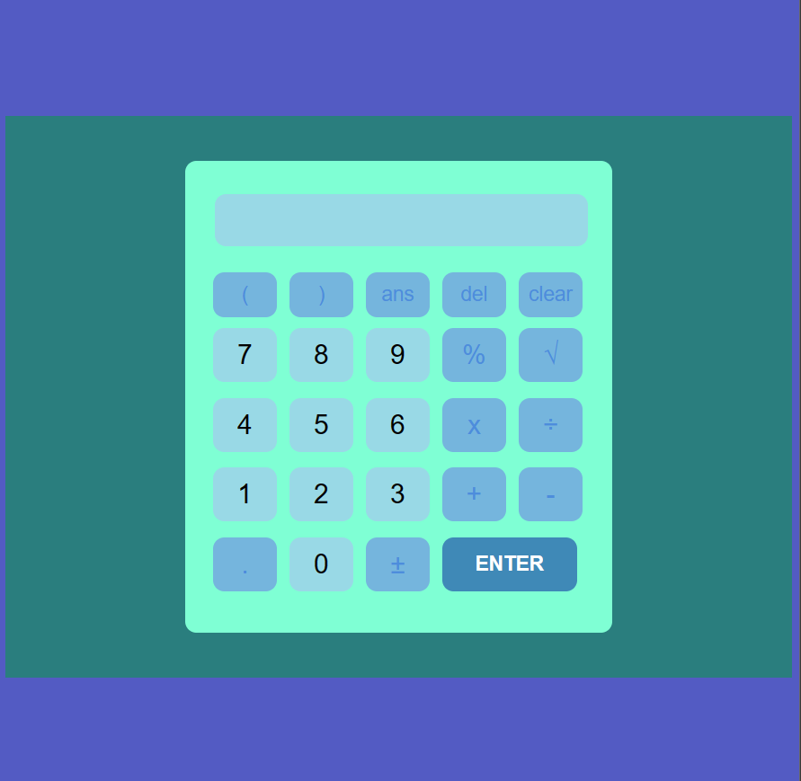

# Calculator

## Description

The Calculator is a simple web application that provides basic arithmetic operations. It allows users to perform addition, subtraction, multiplication, division, percentage calculation, and square root operation.

## Features

- Basic Arithmetic Operations: Addition, Subtraction, Multiplication, and Division.
- Percentage Calculation: Calculate the percentage of a given number.
- Square Root Operation: Find the square root of a number.
- Error Handling: The calculator handles division by zero and invalid expressions gracefully.

## Usage

1. Open the `index.html` file in your web browser.
2. Enter the mathematical expression using the provided buttons or your keyboard.
3. Use the "ENTER" button to evaluate the expression.
4. The result will be displayed in the input field below.
5. Use the "clear" button to reset the input field.

## Screenshots

## Technologies Used

- HTML, CSS, JavaScript

## Credits

This web application was created as a part of the [Final Year Project Name] by [Your Name]. It is a simple demonstration of basic arithmetic operations using JavaScript.

## License

This project is open-source and available under the [MIT License](LICENSE).

Feel free to use, modify, and contribute to this open-source project!
